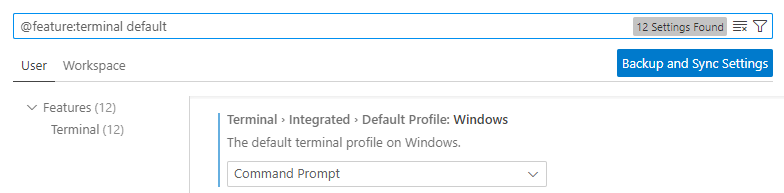

# Estimación de áreas pequeñas mediante modelos de clasificación

--- 

## Tabla de contenidos

1. [Revisión bibliográfica](#revisión-bibliográfica)
2. [Configuración de Python](#configuración-python)
    2.1 [Anaconda](#anaconda)
    2.2 [Anaconda Prompt](#anaconda-prompt)
    2.3 [Dirección de instalación](#dirección-de-instalación)
    2.4 [Variables de sistema](#variables-de-sistema)
    2.5 [Command Prompt](#command-prompt)
3. [Configuración de R y Rstudio](#configuración-de-r-y-rstudio)
4. [Visual Studio Code](#visual-studio-code)
    4.1 [Extensiones necesarias](#extensiones)
5. [Control de Versión Git](#git)
6. [Python](#python)
7. [R software](#r)
8. [Contacto](#contacto)
---
## Revisión bibliográfica


---
## Configuración Python

### Anaconda

Inicialmente se debe descargar el software Anaconda para poder utilizar Python. Para eso, existen dos tipos de instaladores:
    1. MacOS
    2. Windows
Para descargarlo dar seguir el siguiente [enlace](https://www.anaconda.com/download#downloads). Una vez descargado siga las instrucciones del instalador. 
El siguiente paso es agregar la dirección de la carpeta de donde Anaconda está instalado a las variables de ambiente PATH. Para eso siga los siguientes pasos:

### Anaconda Prompt

Una vez instalado, abra *Anaconda Prompt* como se muestra en la siguiente imagen


### Dirección de instalación
El siguiente paso es correr el siguiente comando para obtener la dirección de donde anaconda está instalado.

```powershell
where conda
```
Una vez esto, se debería obtener lo siguiente: 


De esta parte nos va a interesar dos direcciones: 

1. C:\Users\ **%YOURUSER%**\AppData\Local\anaconda3
1. C:\Users\ **%YOURUSER%**\AppData\Local\anaconda3\Scripts

### Variables de sistema

1. Lo primero es buscar las variables del sistema en el ordenador, se ve de la siguiente manera: 


2. Siguiente, se debe mostrar una pantalla con las propiedades del sistema, en el cual, vamos a dar clic en *environment variables* como se muestra en la siguiente imagen:


3. A partir de aquí, vamos a buscar bajo el cuadro de *user variables for %USER%* y vamos a colocarnos en la variable denominada *path* y vamos a dar clic en *Edit...* como se observa en la siguiente imagen: 


4. Por último, vamos a agregar las dos direcciones que se mencionaron en [Dirección de instalación](#dirección-de-instalación). Para esto vamos a dar clic en *New* e ingresamos los dos valores. Una vez realizado esto, damos ok para guardar los cambios. Se debería observar algo como lo siguiente:


### Command Prompt

Como último paso de instalación revisamos que el paso anterior haya funcionado. Para eso abrimos el interprete de *command prompt* y ejecutamos la siguiente línea de código donde especificamos la versión con la que ejecutamos Anaconda.

```powershell
conda --version
```


---
## Configuración de R y RStudio
Para la descarga de R como software siga el siguiente [enlace](https://cran.r-project.org/bin/windows/base/). Una vez instalado el software, se debe descargar e instalar la interfaz RStudio para facilitar la creación y lectura de los archivos `.R` o `.Rmd` y demás variaciones.  


---
## Visual Studio Code

Visual Studio Code es un editor de código muy poderoso desarrollo por Microsoft para Windows, MacOS y Linux. Este facilita la capacidad de colaboración entre equipos y da soporte a muchos lenguajes de programación como Python y R. 
Para este caso, vamos a utilizarlo únicamente para desarrollar el código de Python, ya que para R se utiliza la interfaz de Rstudio, refierase a [Configuración de R y RStudio](#configuración-de-r-y-rstudio).
Para la descarga de Visual Studio Code seguir el siguiente [enlace](https://code.visualstudio.com/). Para su instalación siga la instalación por *default*.

### Extensiones


---
## Git


---
## Python

Una vez realizado los pasos en la sección [Configuración de Python](#configuración-python) y [Visual Studio Code](#visual-studio-code) se debe crear un ambiente de trabajo con las librerias necesarias para ejecutar el código. Para eso, se va a ejecutar el siguiente código que crea el ambiente basado en un archivo `.yml` que contiene el nombre del ambiente y las dependencias que son las librerias requeridas para ejecutar líneas de código. Este archivo se puede actualizar constantemente con la idea de mantener el ciclo activo de las actualizaciones de las librerias. 
1. Inicialmente vamos a ir a la barra del Visual Studio Code y dar clic en *Terminal* > *New Terminal*. Luego, en la esquina inferior derecha se muestra un símbolo `+` con un menú que se despliega hacia abajo, vamos a dar clic en *Configure Terminal Settings* y eso va a abrir una pestaña aparte con las configuraciones. A partir de acá en la barra de búsqueda buscamos *default* como se muestra en la imagen a continuación:



Posteriormente, buscamos la opción ==Terminal > Integrated > Default Profile: Windows== y en el menú que se despliega seleccionamos **Command Prompt** como intérprete. 

Una vez realizado esto, volvemos a la barra superior de *Visual Studio Code* y en *Terminal* seleccionamos *New Terminal*

Para crear el ambiente, ejecute el siguiente código en la terminal 

---
## R

---
## Contacto