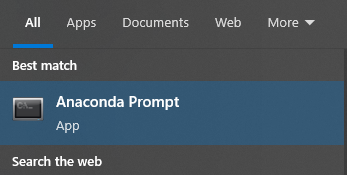
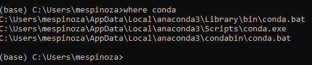
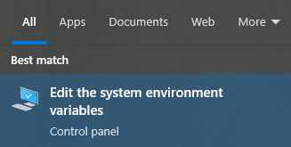
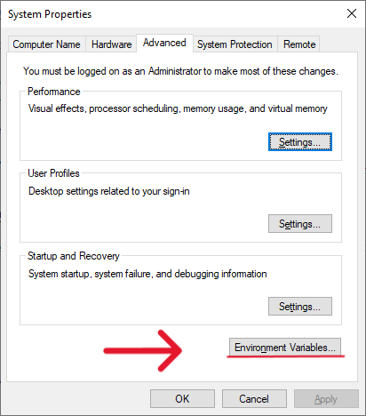
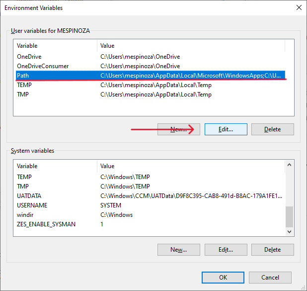
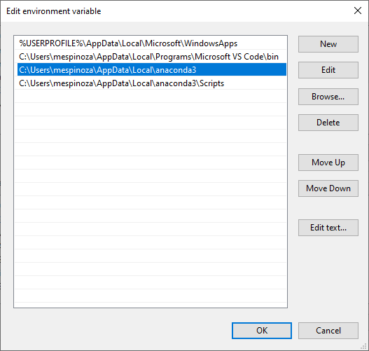
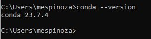

# Estimación de áreas pequeñas mediante modelos de clasificación

--- 

## Tabla de contenidos

1. [Revisión bibliográfica](#revisión-bibliográfica)
2. [Configuración de ambiente de Python](#configuración-python)
    2.1 [Anaconda](#anaconda)
3. [R software](#r-software)

---
## Revisión bibliográfica

---
## Configuración Python

### Anaconda

Inicialmente se debe descargar el software Anaconda para poder utilizar Python. Para eso, existen dos tipos de instaladores:
    1. MacOS
    2. Windows
Para descargarlo dar seguir el siguiente [enlace](https://www.anaconda.com/download#downloads). Una vez descargado siga las instrucciones del instalador. 
El siguiente paso es agregar la dirección de la carpeta de donde Anaconda está instalado a las variables de ambiente PATH. Para eso siga los siguientes pasos:

### Anaconda Prompt

Una vez instalado, abra *Anaconda Prompt* como se muestra en la siguiente imagen



### Dirección de instalación
El siguiente paso es correr el siguiente comando para obtener la dirección de donde anaconda está instalado.

```powershell
where conda
```
Una vez esto, se debería obtener lo siguiente: 



De esta parte nos va a interesar dos direcciones: 

1. C:\Users\ **%YOURUSER%**\AppData\Local\anaconda3
1. C:\Users\ **%YOURUSER%**\AppData\Local\anaconda3\Scripts

### Variables de sistema

1. Lo primero es buscar las variables del sistema en el ordenador, se ve de la siguiente manera: 



2. Siguiente, se debe mostrar una pantalla con las propiedades del sistema, en el cual, vamos a dar clic en *environment variables* como se muestra en la siguiente imagen:



3. A partir de aquí, vamos a buscar bajo el cuadro de *user variables for %USER%* y vamos a colocarnos en la variable denominada *path* y vamos a dar clic en *Edit...* como se observa en la siguiente imagen: 



4. Por último, vamos a agregar las dos direcciones que se mencionaron en [Dirección de instalación](#dirección-de-instalación). Para esto vamos a dar clic en *New* e ingresamos los dos valores. Una vez realizado esto, damos ok para guardar los cambios. Se debería observar algo como lo siguiente:



### Command Prompt

Como último paso de instalación revisamos que el paso anterior haya funcionado. Para eso abrimos el interprete de *command prompt* y ejecutamos la siguiente línea de código donde especificamos la versión con la que ejecutamos Anaconda.

```powershell
conda --version
```



---
## R software